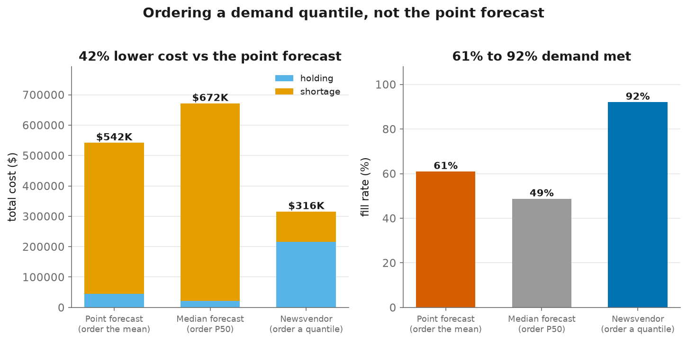
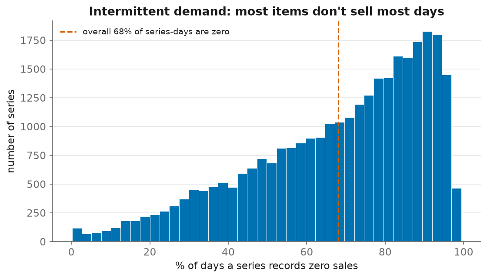
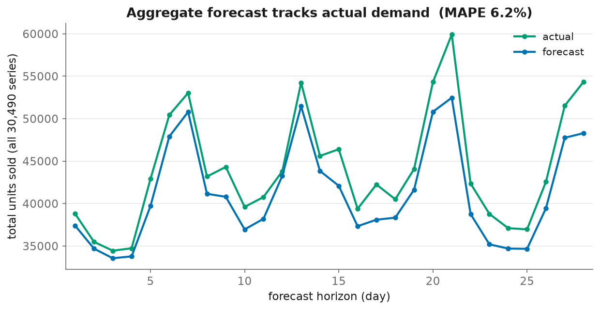
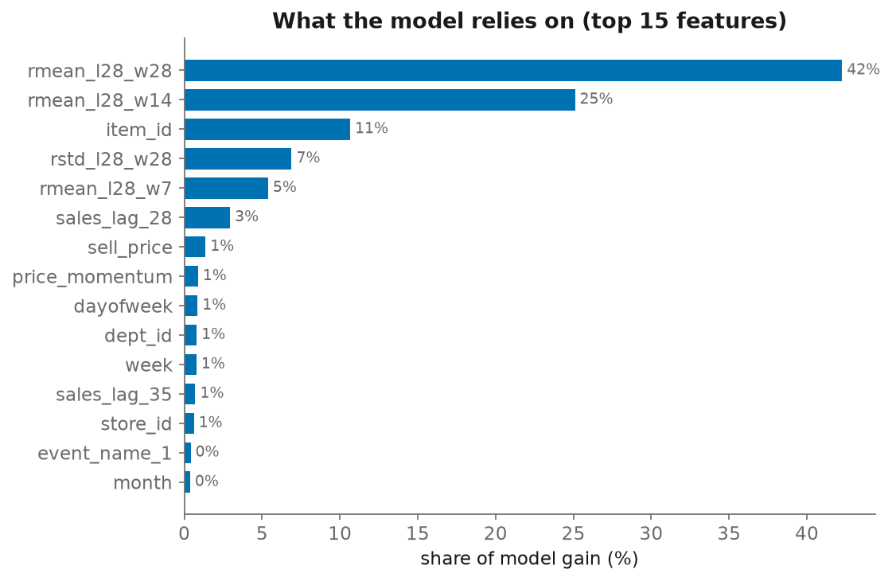
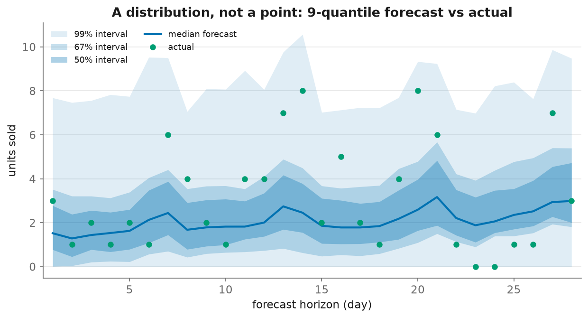
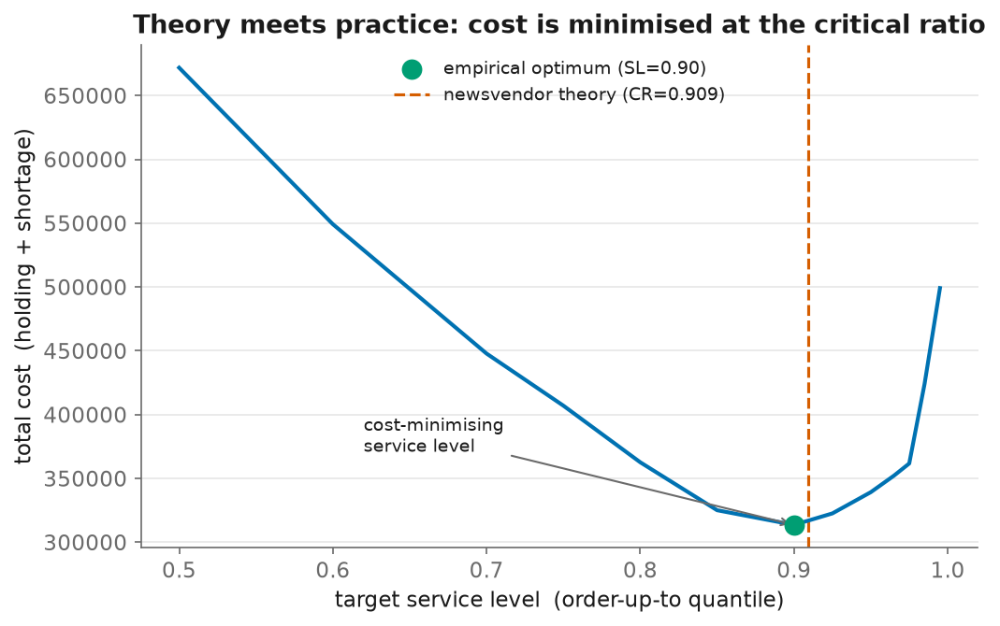

# End-to-End Demand Forecasting → Inventory Optimization

Predict daily unit sales for **30,490 Walmart item-store series**, quantify the
*uncertainty* around each forecast, and turn that uncertainty into **stocking
decisions** whose cost is measured against real held-out demand.

The project is deliberately built in two halves, because a forecast is not a
decision:

1. **Demand forecasting** — a global LightGBM point model (WRMSSE) *and* a
   nine-quantile distributional model (weighted scaled pinball loss).
2. **Inventory / replenishment** — a newsvendor policy on top of those quantiles,
   simulated against actuals, reporting fill rate and cost. *This is what makes
   the forecast worth anything.*

Everything here is **measured on a frozen held-out window, reproducible, and
covered by 30 automated tests** — including a leakage test that proves no feature
sees the future. Where a result is limited, this README says so.

---

## Results at a glance

**Forecasting** (held-out window d1914–1941, scored once)

| | value |
|---|---|
| **Held-out WRMSSE** (point forecast) | **0.6475** |
| 3-fold rolling-origin CV mean (steering metric) | 0.6401 |
| Seasonal-naive baseline | ~1.08 → we are **~40% better** |
| Bottom-level weighted SPL (9 quantiles) | 0.2606 |

CV and held-out agree within 0.007 — the validation scheme was **not** overfit,
which was the single most common M5 failure mode.

**Inventory decision** (same window, all 30,490 series, `Cu`=0.30·price, `Co`=0.03·price)

| policy | fill rate | **total cost** |
|---|---|---|
| order the point (mean) forecast | 61.0% | $542K |
| order the median forecast | 48.8% | $672K |
| **newsvendor `Q* = F⁻¹(CR)`** | **92.1%** | **$316K (−42% vs the point forecast)** |

vs. the fair baseline — the **point forecast** a planner would actually order to —
the newsvendor policy is **42% cheaper (~$226K)** and lifts fill rate **61% → 92%**.
And the check that ties theory to practice: the **empirically cost-minimising
service level (0.900)** matches the **theoretical critical ratio (0.909)**.



*Ordering a demand **quantile** instead of the point forecast converts a wall of
lost-sales (shortage) cost into holding cost — 42% lower total cost and fill rate
from 61% to 92%. (Ordering the median is worse still, at 49% fill: the median of a
mostly-zero series is ~0.)*

> **Honest scope note.** WRMSSE 0.6475 is a solid, fully-reproducible single-model
> result — not a leaderboard-topping one (strong public single models reach ~0.52
> via heavy tuning / per-store models / ensembling, deliberately out of scope
> here). The quantile model is data-limited (see *Uncertainty*), so its SPL is a
> working number, not a competitive one. The value of this project is the honest,
> end-to-end pipeline from raw data to a costed decision — not a single metric.

---

## The Business Problem

For a retailer, "sales forecasting" alone is insufficient: it ignores demand lost
during stockouts, and it says nothing about *how much to order*. This project
targets **demand forecasting → replenishment** to manage two costly risks:

1. **Stock-outs** — lost revenue when demand exceeds what's on the shelf.
2. **Overstocking** — holding, markdown and spoilage cost on slow-moving items.

The catch that makes it hard: **68% of the bottom-level series-days are zeros**
(intermittent demand). The right order quantity for such items is emphatically
*not* the average forecast — it's a tail quantile — which is why the project
carries the demand *distribution* all the way through to the decision.



*Most items don't sell on most days. A model that minimises average error learns
to predict ~0, so the *average* forecast is useless for stocking — you need the
upper tail.*

---

## Solution Part 1 — The Forecasting Model

A single **global LightGBM** (one model learning across all series, not 30k local
ones), chosen and configured for retail's specific quirks.

### Handling intermittent demand (the Tweedie advantage)
Standard RMSE treats the many zeros as noise and under-forecasts. The model uses
a **Tweedie objective** (`variance_power=1.1`), a compound Poisson-Gamma loss that
jointly captures *whether* an item sells and *how much* — a large improvement on
slow-moving inventory over RMSE/Poisson.

### Feature engineering
The base recipe is ~30 features capturing temporal dynamics and pricing:
* **Lags & rolling stats** — sales lags (28–35) and rolling mean/std, all **≥ 28
  days** so one model forecasts the whole 28-day horizon with no recursion and no
  leakage.
* **Price** — price vs. its own history (momentum), a proxy for elasticity.
* **Calendar** — events, and per-state **SNAP** (food-stamp) flags, which move
  FOODS demand materially.

Additional feature groups (longer rolling windows, richer price/calendar signals)
were implemented and **A/B-tested on CV — and shelved because they produced no
measurable gain** at fixed hyperparameters. Reporting what *didn't* work is part
of the point; see [docs/05-features.md](docs/05-features.md).



*At the aggregate level the model tracks the weekly seasonality closely (6.2%
MAPE); the small persistent gap below actual is the known conservative bias of a
median/Tweedie forecast.*

The model leans on recent demand level (rolling means) and item identity, with
price and calendar as secondary signals — sensible and interpretable:



### How it's validated
Rolling-origin backtests on three 28-day windows (never random splits), steering
on the CV mean, with d1914–1941 held out and touched once. See
[docs/04-validation.md](docs/04-validation.md).

---

## Solution Part 2 — Uncertainty (the distribution)

The inventory decision needs `F⁻¹`, not a point estimate — so the model also
forecasts **nine quantiles** (`0.005 … 0.995`) and is scored with **WSPL**
(weighted scaled pinball loss), the official M5 uncertainty metric.

* Direct quantile regression — either nine LightGBM fits or, faster, **one
  XGBoost multi-output fit** (`reg:quantileerror` over all nine alphas at once).
* Independent fits can cross (`q_0.005 > q_0.995`); predictions are **sorted per
  (series, day)** to stay a valid distribution.



*The output is a full distribution per series-day. The inventory policy reads its
order quantity straight off this fan.*

**Limitation, stated plainly:** this model is trained on ~4.1M rows (vs. the point
model's 42M) because multi-quantile training is expensive. A retrain at 4× the
rounds moved SPL only 0.2618 → 0.2606 — proving **rounds aren't the bottleneck,
training-data volume is.** More data is the clearest remaining win. See
[docs/07-uncertainty.md](docs/07-uncertainty.md).

---

## Solution Part 3 — Inventory / Replenishment (the differentiator)

The **newsvendor model** turns a demand distribution into an order quantity:

```
critical ratio  CR = Cu / (Cu + Co)          # Cu = shortage cost, Co = overage cost
optimal order   Q* = F⁻¹(CR)                 # a QUANTILE of demand, not the mean
```

Because stockouts cost more than leftovers (`Cu > Co`), `CR > 0.5` and the optimal
order sits **above** the point forecast. We simulate a periodic-review policy
against **actual realised demand**, carrying inventory over day to day, and report
fill rate, stockout rate, and holding/shortage/total cost.

**Result:** vs. ordering the point forecast, the newsvendor policy cuts total cost
**−42% (~$226K)** and lifts fill rate **61% → 92%**. The sharpest finding: with
**68%** of series-days being zeros, the *median* forecast is *0* for most SKU-days
(ordering it gives only 49% fill) — so a central forecast structurally under-serves
intermittent demand, and no amount of accuracy tuning fixes that; you need the
distribution.



*Sweeping the service level traces a cost U-curve whose empirical minimum (0.90)
lands almost exactly on the newsvendor critical ratio (0.909) — the model and the
theory agree.*

The simulation also supports a non-zero **lead time**, where stock must cover the
`L+R`-day protection interval. Since **quantiles are not additive**, that interval
is built by sampling demand paths and re-extracting the quantile. Full analysis,
including the service-level/cost trade-off curve, in
[docs/08-inventory.md](docs/08-inventory.md).

---

## Engineering, Reproducibility & Deployment

**Reproducibility is a first-class feature here.** Pinned dependencies (an
unpinned `>=` silently changed a result mid-project); `deterministic=True` after
measuring ±0.01 run-to-run noise; a feature cache; an experiment ledger; and **30
tests** pinning the metrics, the economics, and the no-leakage guarantee.

Large training runs were executed on **GCP** (`e2-highmem` / `n2-highmem` VMs,
driven by the scripts in `scripts_vm/`), staged through GCS, and torn down after
each run.

**Target production architecture (design).** The original deployment was aimed at
a serverless **AWS** batch-inference pipeline — **SageMaker Batch Transform**
orchestrated by **Step Functions**, triggered by **EventBridge**, post-processed
by **Lambda**, surfaced in **QuickSight**. The implemented core of that path (the
SageMaker training/transform scripts) is preserved under `legacy/`; the Step
Functions / Lambda / QuickSight orchestration is design, not running code. The
rebuilt system in `src/` is cloud-agnostic and was validated on GCP.

---

## Tech Stack

* **Modeling:** Python, LightGBM (Tweedie), XGBoost (multi-quantile), Pandas, NumPy
* **Validation & testing:** rolling-origin CV, pytest (30 tests incl. leakage)
* **Compute:** GCP Compute Engine + Cloud Storage
* **Deployment (target/legacy):** AWS SageMaker Batch Transform, Step Functions,
  Lambda, S3, EventBridge, QuickSight

---

## Repository layout

```
src/         data, features, cache, metrics (WRMSSE + WSPL), CV harness,
             quantile forecasting, newsvendor inventory sim, plots, baseline/submission
tests/       30 tests: metrics, economics, and the leakage guarantee
docs/        01-data · 02-wrmsse · 03-baseline · 04-validation · 05-features
             · 06-results · 07-uncertainty · 08-inventory · experiment logs · img/
scripts_vm/  cloud run scripts
legacy/      the original SageMaker/Docker attempt (kept, not used)
Makefile     make install | test | lint | figures
```

## Quickstart

```bash
pip install -r requirements.txt          # place the M5 CSVs in data/ (see docs/01-data.md)
PYTHONPATH=. pytest tests/ -q            # 30 tests

# Point forecast: train + score on the held-out window
python -m src.cv --name best --train-start-day 300 --day-floor 300 --final-test

# Uncertainty: nine-quantile forecasts
python -m src.run_uncertainty --name q --fold final --train-start-day 1750 \
    --day-floor 300 --backend xgboost --device cpu --save-preds

# Inventory: newsvendor policy + cost/service trade-off
python -m src.run_inventory --quantiles "outputs/predictions/quantiles_*.parquet"

# Regenerate the figures in docs/img
python -m src.plots
```

Common tasks are wrapped in a `Makefile`: `make install`, `make test`,
`make lint`, `make figures`.

## Documentation

| Doc | Contents |
|-----|----------|
| [01-data](docs/01-data.md) | Dataset, files, timeline, quirks |
| [02-metric-wrmsse](docs/02-metric-wrmsse.md) | WRMSSE, explained and validated |
| [03-baseline](docs/03-baseline.md) | Baseline model and design choices |
| [04-validation](docs/04-validation.md) | Rolling-origin CV strategy |
| [05-features](docs/05-features.md) | Feature groups and what did/didn't work |
| [06-results](docs/06-results.md) | Headline results, noise finding, submission |
| [07-uncertainty](docs/07-uncertainty.md) | Quantile forecasting + WSPL |
| [08-inventory](docs/08-inventory.md) | **Newsvendor policy, simulation, trade-off** |
| [09-intermittent](docs/09-intermittent.md) | Croston / SBA / TSB vs. the ML model, and when each wins |
| [10-reconciliation](docs/10-reconciliation.md) | Hierarchical reconciliation (bottom-up, OLS, WLS, MinT) |
