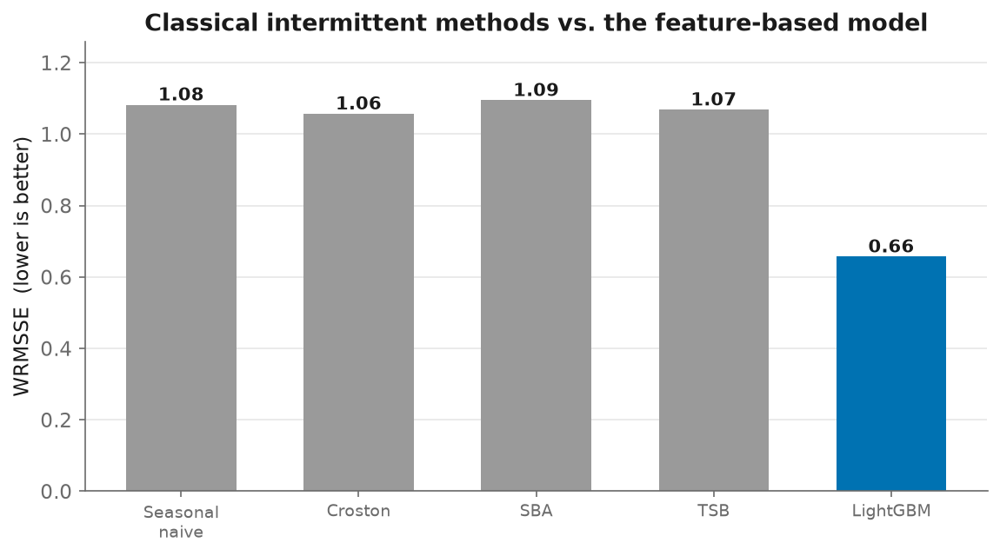

# 09 - Intermittent Demand: Croston, SBA, TSB (and when they win)

> "Do you know Croston/TSB?" is a standard retail-forecasting screen. The better
> question, the one this page answers, is *when* those classical methods are the
> right tool, and *why* a feature-based gradient booster beats them here.

## Why this matters on M5

Most retail SKUs don't sell every day. Classifying all 30,490 series by the
**Syntetos-Boylan-Croston** scheme (average demand interval `ADI` vs. squared CV
of non-zero sizes `CV²`, cutoffs 1.32 / 0.49):

| class | ADI | CV² | count | share |
|---|---|---|---|---|
| smooth | low | low | 980 | 3% |
| **intermittent** | high | low | 23,102 | **76%** |
| erratic | low | high | 497 | 2% |
| **lumpy** | high | high | 5,911 | **19%** |

**95% of the catalogue is intermittent or lumpy.** This is a
Croston-family problem, which is exactly why the point model uses a **Tweedie**
objective (a compound Poisson-Gamma loss built for this) rather than RMSE.

## The methods ([`src/intermittent.py`](../src/intermittent.py))

All three forecast a *flat per-period rate* by separating **how much** sells from
**how often**:

- **Croston (1972)**, exponentially smooth the non-zero demand *sizes* and the
  *intervals* between them separately; forecast = size ÷ interval.
- **SBA (Syntetos-Boylan)**, Croston is provably biased; SBA multiplies by
  `(1 - α/2)` to debias. The recommended default in practice.
- **TSB (2011)**, smooths the demand *probability* every period instead of the
  interval, so it **decays a dead SKU toward zero**, the right choice for
  obsolescence / end-of-life, which Croston can't represent.

## The benchmark ([`src/run_intermittent.py`](../src/run_intermittent.py))

Fit on d1–d1913, forecast d1914–1941, score with WRMSSE; also the mean
*bottom-level* RMSSE within each demand class.

| method | **WRMSSE** | smooth | intermittent | erratic | lumpy |
|---|---|---|---|---|---|
| seasonal-naive | 1.082 | 0.745 | 0.778 | 0.678 | 0.735 |
| croston | 1.057 | 0.749 | 0.782 | 0.703 | 0.738 |
| sba | 1.095 | 0.747 | 0.780 | 0.700 | 0.736 |
| tsb | 1.068 | 0.739 | 0.778 | 0.662 | 0.731 |
| **lightgbm** | **0.657** | 0.722 | 0.772 | 0.682 | 0.728 |

(The LightGBM column is the saved point-forecast artifact, `train_start=1300`,
which scores 0.6567 on its own. The best-tuned configuration is `train_start=300`
at 0.6401 CV / 0.6475 held-out, documented in [06-results.md](06-results.md); the
downstream benchmarks use the saved artifact. The gap does not change any
conclusion here.)

## The insight (this is the interview answer)

Two things are true at once, and holding both is the point:

1. **Overall, LightGBM beats the classical methods** (0.66 vs ~1.06 WRMSSE, a
   ~39% gap). Croston/SBA/TSB barely edge out the seasonal-naive benchmark.
2. **At the bottom single-series level they're nearly tied** (RMSSE within ~2–6%
   in every demand class).

Why the huge overall gap but near-parity per series? Because the classical
methods produce a **flat line**, no day-of-week seasonality, no price/event/SNAP
covariates. On a single noisy intermittent series there's little structure to
capture, so everyone is close. But WRMSSE also scores the **aggregate levels**
(store, state, category totals), where weekly seasonality and promotions are
strong and predictable, and there the flat forecasts fall apart while the
feature model shines. The ML advantage **compounds up the hierarchy.**

**So when do you reach for Croston/TSB?** When the demand is the pure-intermittent
case they were designed for: **spare parts / slow movers with no seasonality, no
covariates, and little history**, where a robust size-÷-interval rate is hard to beat and needs almost no data. That's a large slice of real supply chains.

**And "why does naive deep learning usually lose to gradient boosting here?"**
Same root cause: per-series signal is weak and the useful information is in
**tabular covariates** (price, calendar, SNAP) and cross-series structure, which
GBMs exploit efficiently with little tuning, while a deep net needs far more data
and care to match, and a *global* GBM already borrows strength across series.

## Correctness

`tests/test_intermittent.py` (8 tests) pins the methods on cases with known
answers: constant demand recovers its level, demand every 2nd period gives
half-rate, SBA sits exactly `(1-α/2)` below Croston, TSB **decays after demand
stops**, and the ADI/CV² classification lands each series in the right quadrant.
