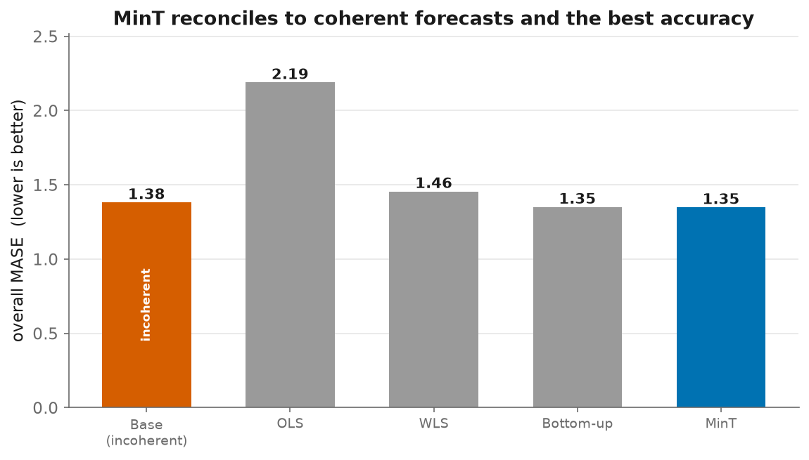

# 10 - Hierarchical Reconciliation

> Forecasts made independently at each level of a hierarchy don't add up: the
> item forecasts don't sum to the department forecast, which doesn't sum to the
> total. Finance plans off the top, replenishment off the bottom, and they
> disagree. **Reconciliation** forces coherence, and done right, it also
> *improves accuracy* by borrowing strength across levels.

## The setup

A tractable, standard sub-hierarchy of M5 (national, summed over stores):

```
Total (1)  ->  Category (3)  ->  Department (7)  ->  Item (3,049)
```

3,060 nodes, 3,049 at the bottom. We fit an **independent exponential-smoothing
forecast at every node** (per-node optimised α), which makes the base forecasts
**incoherent on purpose**, the whole point of reconciliation.

Measured incoherence of the base forecast: **total = 42,382 vs. sum of items =
43,968, a 3.7% gap.** Operationally that gap is the argument two teams have.

## The methods ([`src/reconcile.py`](../src/reconcile.py))

Every method reconciles as `ỹ = S·G·ŷ` (`S` = summing matrix, `G` = the mapping to
the bottom level); they differ only in `G`:

| method | idea |
|---|---|
| **bottom-up** | forecast the bottom, sum up. Coherent, robust, ignores aggregate signal. |
| **top-down** | forecast the total, split by historical proportions. Good top, weak bottom. |
| **OLS** | `G=(SᵀS)⁻¹Sᵀ`, MinT with identity error covariance (all nodes weighted equally). |
| **WLS (struct)** | weight each node by how many series it aggregates. |
| **MinT (shrink)** | weight by the (shrunk) covariance of base forecast errors, the minimum-trace optimal reconciliation (Wickramasuriya et al. 2019). |

## Results ([`src/run_reconcile.py`](../src/run_reconcile.py))

MASE per level on the held-out window (lower is better); `coherent` = the
forecasts add up.



| method | coherent | Total | Category | Department | Item | **overall** |
|---|---|---|---|---|---|---|
| base (unreconciled) | | 1.212 | 1.316 | 1.607 | 1.387 | 1.381 |
| bottom_up | | 1.243 | 1.245 | 1.524 | 1.387 | 1.350 |
| **OLS** | | 1.242 | 1.849 | 3.919 | 1.748 | **2.189** |
| wls_struct | | 1.351 | 1.287 | 1.729 | 1.452 | 1.455 |
| **MinT (shrink)** | | 1.249 | 1.249 | **1.508** | 1.387 | **1.348** |

## What this shows (the interview points)

1. **MinT gives you coherence for free, and a little accuracy on top.** It's the
   best overall (1.348 < base 1.381), improving the *aggregate* levels (Category
   1.316->1.249, Department 1.607->1.508) while leaving the item forecasts
   unchanged. That's the "borrow strength across levels" benefit.

2. **OLS is a trap (2.19, far worse than doing nothing).** It weights every node
   equally, so the enormous Total-level series dominates the least-squares fit and
   corrupts the tiny item forecasts. This is *the* reason WLS/MinT exist,
   weighting by scale / error variance is not optional at real hierarchies.

3. **Bottom-up is a strong, honest default** (1.350, basically tied with MinT
   here). When base forecasts are noisy and you don't trust the aggregate models,
   bottom-up's simplicity wins, which is why our main pipeline forecasts the
   bottom level and lets WRMSSE aggregate. MinT earns its keep when the
   aggregate-level series carry real, separable signal.

## Correctness

`tests/test_reconcile.py` (10 tests) pins the linear algebra: outputs are always
coherent; the projection methods (OLS/WLS/MinT) leave already-coherent forecasts
unchanged; top-down splits by the given proportions; and MinT's shrinkage
covariance is symmetric with an untouched diagonal.
