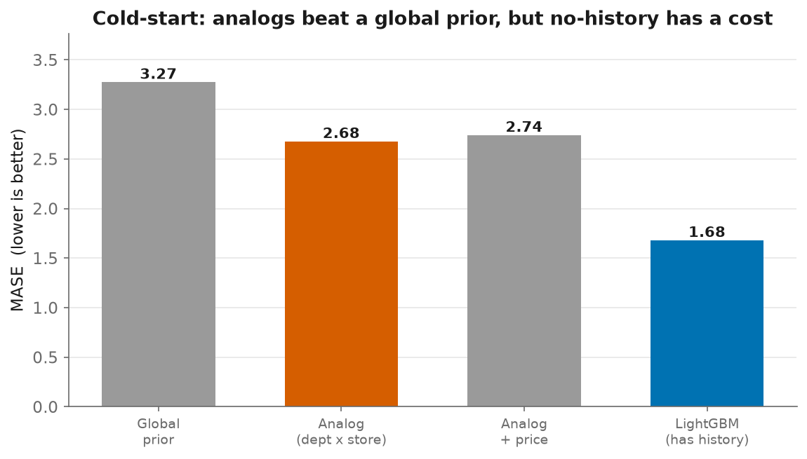

# 11 - New-Product / Cold-Start Forecasting

> A brand-new SKU has **no sales history**, so every lag, rolling-mean, and
> "days since last sale" feature the main model relies on is undefined. You can't
> forecast a product from its past when it has no past. You forecast it the way a
> buyer does: from **analogs**. Handling this well is the line between someone who
> understands the retail business and someone who only knows time series.

## The method ([`src/coldstart.py`](../src/coldstart.py))

1. Summarise every existing series by its **day-of-week demand profile** (mean
   units sold on each weekday over training), this carries the weekly
   seasonality a newcomer will inherit.
2. For a new (item, store), forecast = the **mean profile of its analog group**
   (same *department × store*), computed **excluding the item itself** so none of
   the "new" product's own history leaks in.
3. Optionally scale by a **price factor**: an item priced below its peers is
   expected to sell somewhat more (a soft, bounded elasticity prior, *not* a
   causal estimate).

## The experiment ([`src/run_coldstart.py`](../src/run_coldstart.py))

We treat **all 30,490 item-stores as if they were new**, hide each one's own
history, forecast it from analogs, and score MASE against the real held-out
demand. As reference points: a **global prior** (the catalogue-wide weekday
profile, the best you could do knowing nothing about the item) and the full
**LightGBM** model that *does* use history (the ceiling).

| method | MASE |
|---|---|
| global weekday profile (knows nothing) | 3.273 |
| **analog (dept × store)** | **2.676** |
| analog + price factor | 2.739 |
| LightGBM (uses history) | 1.678 |

## What this shows

1. **Analogs carry real signal.** The attribute-analog forecast (2.68) is far
   better than a global prior (3.27), it recovers **~37% of the gap** between
   "know nothing" and the full history-based model. Similar products in the same
   department and store predict a newcomer's demand shape.

2. **There is an irreducible cost to having no history.** Even the best cold-start
   forecast is **+59% MASE** vs. the model that sees the item's own sales
   (2.68 vs 1.68). That gap is *why* cold-start is treated as its own problem, why
   retailers invest in rich product-attribute data, and why a new launch is
   monitored closely until enough history accrues to switch to the main model.

3. **The price factor didn't help (2.74 > 2.68), an honest negative result.** A
   crude `(peer price / item price)^β` multiplier adds more noise than signal here.
   Doing it right means *estimating* elasticity causally (price changes aren't
   random), which is a different, harder problem, deliberately out of scope (see
   the pricing note in the roadmap).

**The practical takeaway**, the one to say in an interview: you forecast a new
product by borrowing the demand *shape* of its closest analogs, you expect a real
accuracy penalty until it has history of its own, and you graduate it onto the
main model once it does. Getting the analog definition right (attributes, price
tier, region) matters more than the model.

## Correctness

`tests/test_coldstart.py` (5 tests) pins the core: the group mean **excludes the
series itself** (no leakage of the "new" item's history), singleton groups yield
no analog, the price factor moves in the right direction and stays bounded, and
forecasts inherit the analog group's weekday profile over the horizon.
