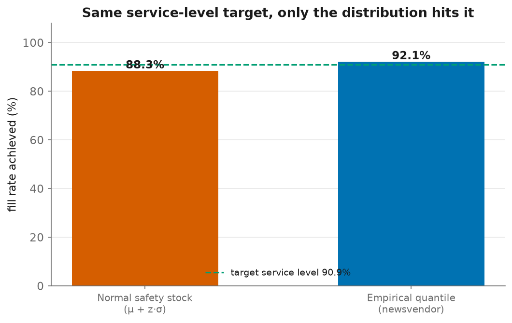

# 12 - Safety Stock, Reorder Points, and the Newsvendor Link

> "Safety stock" is the number every planner actually works with. This closes the
> loop: the classical `μ + z·σ` safety-stock formula **is** the newsvendor order , 
> under a normal-demand assumption, and showing exactly where that assumption
> breaks is the quantitative case for forecasting the whole distribution.

## The classical formulas ([`src/safety_stock.py`](../src/safety_stock.py))

With daily demand mean `μ`, standard deviation `σ`, lead time `L`, review period `R`:

| quantity | formula |
|---|---|
| service factor | `z = Φ⁻¹(service level)` |
| **safety stock** | `SS = z · σ · √(L + R)` |
| **reorder point** (continuous review) | `ROP = μ·L + z·σ·√L` |
| **order-up-to** (periodic review) | `S = μ·(L + R) + z·σ·√(L + R)` |

The `√(L + R)` is the **protection interval**: stock must cover demand variability
over the whole window until the next order lands, and variance adds over
independent days.

## The link to the newsvendor (this is the "aha")

Order-up-to `S = μ + z·σ` is just the **demand quantile at probability `Φ(z)` , 
if demand is normal.** Set the service level to the newsvendor critical ratio
`CR = Cu/(Cu+Co)` and safety stock **is** the newsvendor order, rewritten as
"mean + buffer" instead of `F⁻¹(CR)`:

```
safety-stock order-up-to  =  μ + Φ⁻¹(CR)·σ   ≈   F⁻¹(CR)   (only if demand ~ Normal)
```

So the two inventory pillars in this project are the same decision under different
demand models, the parametric (Gaussian) one and the empirical (quantile) one.

## Where the Gaussian assumption breaks ([`src/run_safety_stock.py`](../src/run_safety_stock.py))

Both methods are set to the **same** service-level target (the critical ratio,
90.9%) and simulated against actual demand:



| method | target SL | **fill rate achieved** | total cost |
|---|---|---|---|
| normal safety stock (`μ + z·σ`) | 90.9% | **88.3%** (under target) | 313,887 |
| empirical quantile (newsvendor) | 90.9% | **92.1%** (on target) | 315,857 |

**Same target, different outcome.** The normal formula **under-stocks** and misses
its own service goal by ~2.6 points, because retail demand is **zero-inflated and
right-skewed**: the normal distribution has thin, symmetric tails (and formally
allows negative demand), so `μ + z·σ` sits below the true 91st percentile. The
**empirical quantile** reads the buffer straight off the forecast distribution and
lands on target.

## The takeaway (and why it justifies the whole project)

This is the quantitative argument for the distributional forecast:

- Safety stock is fine, standard, and interpretable, **when demand is roughly
  normal** (fast-moving, smooth items). Then `μ + z·σ` and `F⁻¹(CR)` agree.
- For **intermittent / lumpy** demand, 95% of this catalogue (see
  [09-intermittent.md](09-intermittent.md)), the normal approximation is
  mis-calibrated, and you should size the buffer from the **actual demand
  quantiles** instead. Which is exactly why the pipeline forecasts nine quantiles
  and feeds `F⁻¹(CR)` to the newsvendor.

**Interview one-liner:** *"Safety stock is the newsvendor under a normal
assumption, `μ + zσ` is just `F⁻¹` of the service level for a Gaussian. That's
fine for smooth demand, but retail is zero-inflated and right-skewed, so the
normal formula under-stocks and misses its service target; I size the buffer from
the forecast's own quantiles instead."*

## Correctness

`tests/test_safety_stock.py` (7 tests) pin the formulas: the service factor matches
known normal quantiles (z=0 at 50%, ≈1 at 84.1%, ≈2 at 97.7%), safety stock scales
with `√(L+R)` and with the service level, a 50% service level needs zero buffer,
and order-up-to = mean demand + safety stock.
